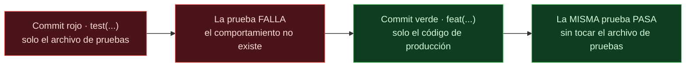
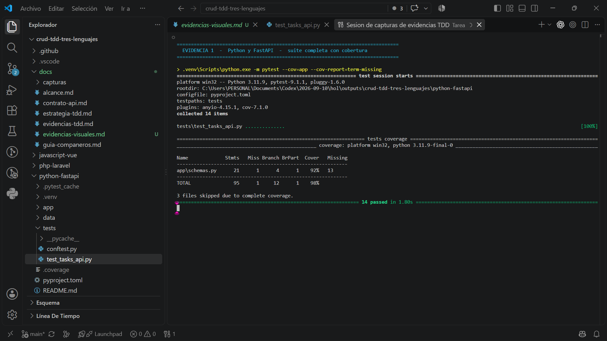
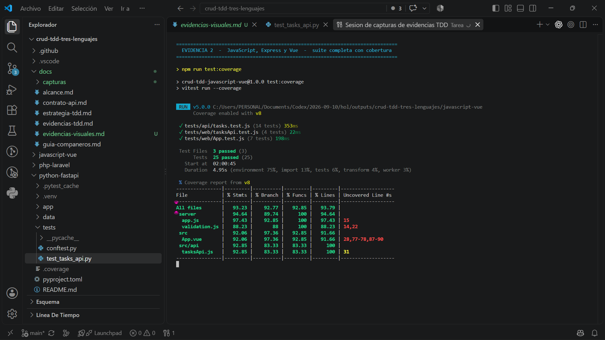
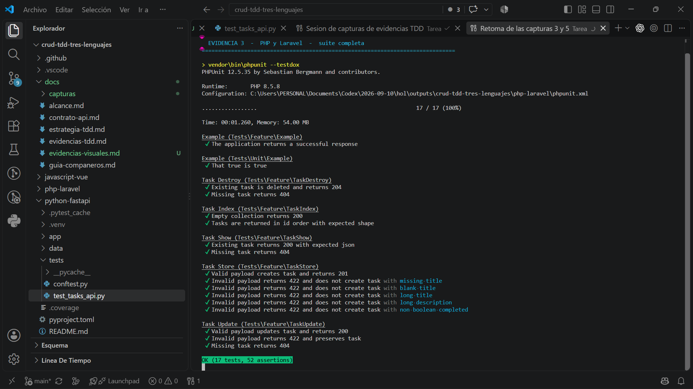
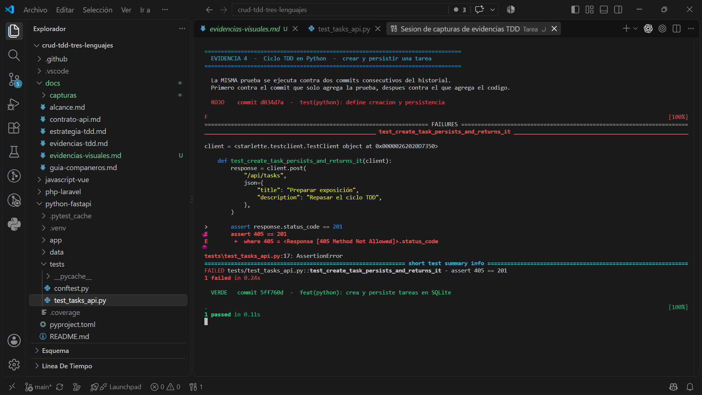
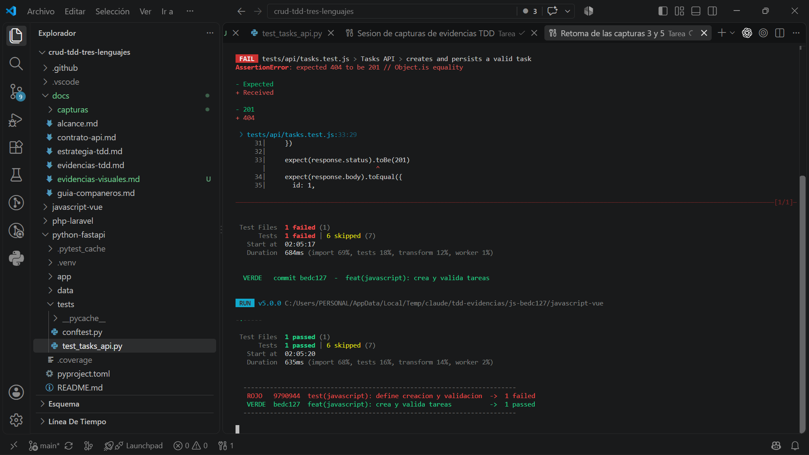
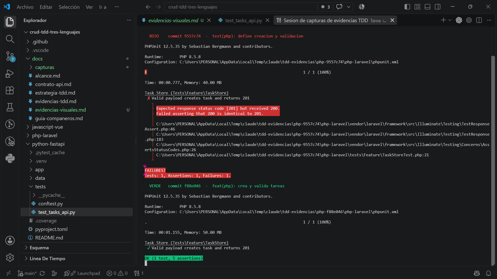
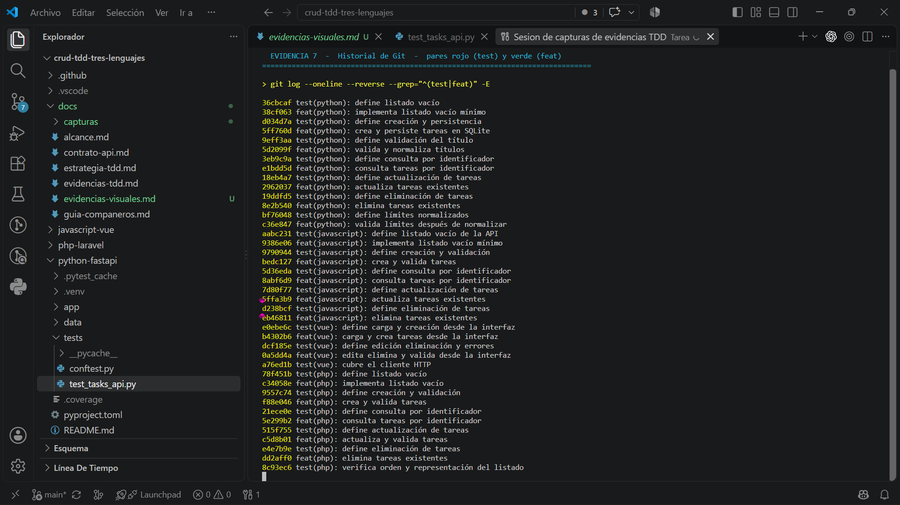

# Evidencias de la aplicación de TDD

Este documento demuestra que los tres CRUD del repositorio se construyeron con desarrollo guiado por pruebas. No se limita a mostrar que las pruebas pasan: eso solo probaría que existen pruebas. Lo que aquí se evidencia es el **orden**, es decir, que cada prueba se escribió **antes** que el código que la satisface.

Documento complementario: [evidencias-tdd.md](evidencias-tdd.md) lista la tabla completa de pares rojo-verde de los tres lenguajes. Aquí se profundiza en un ciclo por lenguaje y se acompaña con la ejecución real.

### De un vistazo

| | Python y FastAPI | JavaScript, Express y Vue | PHP y Laravel |
| --- | :---: | :---: | :---: |
| Pruebas | **14** | **25** | **17** (52 aserciones) |
| Cobertura | **98 %** | **93 %** | — |
| Ciclos rojo-verde | **7** | **7** | **5** |
| Ciclo evidenciado | `d034d7a` → `5ff760d` | `9790944` → `bedc127` | `9557c74` → `f88e046` |

**56 pruebas** en total y **19 ciclos rojo-verde** documentados, todos reproducibles desde este repositorio.

### Contenido

1. [Qué se demuestra y cómo](#1-qué-se-demuestra-y-cómo)
2. [Cómo reproducir estas evidencias](#2-cómo-reproducir-estas-evidencias)
3. [Parte A — Las tres suites en verde](#parte-a--las-tres-suites-en-verde)
4. [Parte B — El ciclo rojo → verde](#parte-b--el-ciclo-rojo--verde)
5. [Parte C — El historial de Git](#parte-c--el-historial-de-git)
6. [Resumen](#resumen)
7. [Apéndice — Recrear las copias de trabajo](#apéndice--recrear-las-copias-de-trabajo)

---

## 1. Qué se demuestra y cómo

Una suite en verde es una evidencia débil: las pruebas pudieron escribirse después del código. La evidencia fuerte de TDD tiene tres partes, y este documento las cubre en ese orden.

| Parte | Pregunta que responde | Evidencia |
| --- | --- | --- |
| A | ¿Las pruebas existen y pasan hoy? | Las tres suites ejecutadas con cobertura |
| B | ¿La prueba se escribió antes que el código? | La misma prueba ejecutada contra el commit anterior a la implementación, donde **falla** |
| C | ¿El patrón se repite en todo el proyecto? | El historial de Git alternando `test(...)` y `feat(...)` |

La parte B es la central. El repositorio conserva, por cada comportamiento, dos commits consecutivos:

- un commit **rojo** que agrega únicamente el archivo de pruebas;
- un commit **verde** que agrega únicamente el código de producción que las satisface.

Como los commits están separados, se puede volver al estado exacto del commit rojo y ejecutar la prueba allí. Si falla, queda probado que la prueba precedió al código.



### Cómo se aisló cada commit sin alterar la rama

Para ejecutar el código de un commit antiguo no se hizo `checkout` sobre la rama de trabajo. Se usó `git worktree`, que materializa un commit en una carpeta aparte dejando `main` intacta:

```powershell
git worktree add --detach C:\...\py-d034d7a d034d7a
```

Cada copia recibió sus dependencias (`.venv`, `node_modules`, `vendor`) y se ejecutó la prueba allí. Esto importa metodológicamente: la prueba que falla y la que pasa son **el mismo archivo**, ejecutado con **el mismo comando**; lo único que cambia entre una y otra es el código de producción.

---

## 2. Cómo reproducir estas evidencias

El proyecto incluye siete tareas de VS Code que ejecutan exactamente lo documentado aquí. En VS Code, con la carpeta del proyecto abierta:

> **Terminal → Ejecutar tarea…** y elegir la evidencia de la lista.

| Tarea | Contenido |
| --- | --- |
| Evidencia 1 | Python — suite completa y cobertura |
| Evidencia 2 | JavaScript y Vue — suite completa y cobertura |
| Evidencia 3 | PHP y Laravel — suite completa |
| Evidencia 4 | Ciclo TDD Python — rojo y verde |
| Evidencia 5 | Ciclo TDD JavaScript — rojo y verde |
| Evidencia 6 | Ciclo TDD PHP — rojo y verde |
| Evidencia 7 | Historial git de pares `test` y `feat` |

Las tareas están definidas en `.vscode/tasks.json` y los guiones que ejecutan viven en [`.vscode/evidencias/`](../.vscode/evidencias/README.md). Ambos se versionan con el repositorio —mediante excepciones explícitas en el `.gitignore`— precisamente para que estas evidencias se puedan reproducir sin reconstruir nada a mano. Las tareas 4, 5 y 6 dependen de las copias de trabajo descritas arriba; el apéndice explica cómo recrearlas.

Quien quiera comprobar los resultados sin VS Code puede ejecutar las suites directamente, como indica el [README](../README.md), o lanzar la verificación completa desde la raíz con `.\scripts\verificar-todo.ps1`.

### Entorno de la ejecución documentada

Las capturas de este documento se tomaron el **12 de septiembre de 2026** sobre Windows 11, con estas versiones:

| Lenguaje | Tiempo de ejecución | Marco de pruebas |
| --- | --- | --- |
| Python | 3.11.9 | pytest 9.1.1 con pytest-cov 7.1.0 |
| JavaScript | Node 24.19.0 | Vitest 5.0.0 con cobertura v8 |
| PHP | 8.5.8 | PHPUnit 12.5.35 |

Las rutas visibles en cada captura corresponden a la ubicación real del repositorio, y las de las evidencias 4, 5 y 6 muestran las carpetas temporales de los commits antiguos: ese detalle es parte de la evidencia, no un descuido.

---

## Parte A — Las tres suites en verde

### Evidencia 1 · Python y FastAPI



*Figura 1. `pytest` sobre `python-fastapi`: 14 pruebas aprobadas y 98 % de cobertura del paquete `app`.*

```
collected 14 items

tests\test_tasks_api.py ..............                                   [100%]

Name             Stmts   Miss Branch BrPart  Cover   Missing
------------------------------------------------------------
app\schemas.py      21      1      4      1    92%   13
------------------------------------------------------------
TOTAL               95      1     12      1    98%

3 files skipped due to complete coverage.
============================= 14 passed in 1.23s ==============================
```

### Evidencia 2 · JavaScript, Express y Vue



*Figura 2. `vitest` sobre `javascript-vue`: 25 pruebas en 3 archivos y más del 92 % en las cuatro métricas de cobertura.*

```
 Test Files  3 passed (3)
      Tests  25 passed (25)

File            | % Stmts | % Branch | % Funcs | % Lines |
----------------|---------|----------|---------|---------|
All files       |   93.23 |    92.77 |   92.85 |   93.79 |
 server         |   94.64 |    89.74 |     100 |   94.64 |
  app.js        |   97.43 |    92.85 |     100 |   97.43 |
  validation.js |   88.23 |       88 |     100 |   88.23 |
 src            |   92.06 |    97.36 |   92.85 |   91.66 |
  App.vue       |   92.06 |    97.36 |   92.85 |   91.66 |
 src/api        |   92.85 |    83.33 |   83.33 |     100 |
  tasksApi.js   |   92.85 |    83.33 |   83.33 |     100 |
```

Esta es la implementación con interfaz: las pruebas de `App.vue` montan el componente real y verifican la interacción del usuario, no solo la API.

### Evidencia 3 · PHP y Laravel



*Figura 3. `phpunit --testdox` sobre `php-laravel`: 17 pruebas y 52 aserciones aprobadas.*

El formato `--testdox` es deliberado: convierte cada nombre de método en una frase legible, de modo que la salida de la terminal se lee como una especificación del comportamiento esperado.

```
Task Store (Tests\Feature\TaskStore)
 ✔ Valid payload creates task and returns 201
 ✔ Invalid payload returns 422 and does not create task with missing title
 ✔ Invalid payload returns 422 and does not create task with blank title
 ✔ Invalid payload returns 422 and does not create task with long title
 ✔ Invalid payload returns 422 and does not create task with long description
 ✔ Invalid payload returns 422 and does not create task with non boolean completed

OK (17 tests, 52 assertions)
```

---

## Parte B — El ciclo rojo → verde

Para cada lenguaje se toma el mismo comportamiento —**crear una tarea y persistirla**— y se ejecuta su prueba contra los dos commits del par.

### Evidencia 4 · Ciclo TDD en Python



*Figura 4. La misma prueba contra `d034d7a` (falla) y contra `5ff760d` (pasa).*

**La prueba** (agregada en `d034d7a`, `test(python): define creación y persistencia`):

```python
def test_create_task_persists_and_returns_it(client):
    response = client.post(
        "/api/tasks",
        json={"title": "Preparar exposición", "description": "Repasar el ciclo TDD"},
    )

    assert response.status_code == 201
    assert response.json() == {
        "id": 1,
        "title": "Preparar exposición",
        "description": "Repasar el ciclo TDD",
        "completed": False,
    }

    list_response = client.get("/api/tasks")
    assert list_response.json() == [response.json()]
```

**Qué criterio de aceptación expresa.** Que `POST /api/tasks` responda `201`, devuelva la tarea creada con un identificador asignado y `completed` en falso por omisión, y que esa tarea quede efectivamente guardada —lo cual se comprueba pidiéndola de vuelta con `GET`, no inspeccionando la base de datos por dentro.

**Por qué falla en rojo.** En `d034d7a` la ruta `POST /api/tasks` no existe. FastAPI tiene registrado el `GET` sobre esa misma ruta, así que no responde `404` sino `405 Method Not Allowed`:

```
>       assert response.status_code == 201
E       assert 405 == 201
E        +  where 405 = <Response [405 Method Not Allowed]>.status_code

tests\test_tasks_api.py:17: AssertionError
1 failed in 0.32s
```

**Qué código mínimo la pone en verde.** El commit `5ff760d` agrega 96 líneas repartidas en tres archivos: el esquema de entrada en `app/schemas.py`, la función de inserción en `app/repository.py` y la ruta en `app/main.py`. Nada más: ni actualización ni borrado, que llegan en ciclos posteriores.

```
1 passed in 0.08s
```

**Qué regresión evita.** Desde ese momento, cualquier cambio que rompa el código de estado, la forma del JSON o la persistencia hace fallar la suite.

### Evidencia 5 · Ciclo TDD en JavaScript



*Figura 5. La misma prueba contra `9790944` (falla) y contra `bedc127` (pasa).*

**La prueba** (agregada en `9790944`, `test(javascript): define creación y validación`):

```javascript
test('creates and persists a valid task', async () => {
  const response = await request(app).post('/api/tasks').send({
    title: 'Preparar exposición',
    description: 'Repasar el ciclo TDD',
  })

  expect(response.status).toBe(201)
  expect(response.body).toEqual({
    id: 1,
    title: 'Preparar exposición',
    description: 'Repasar el ciclo TDD',
    completed: false,
  })

  const listResponse = await request(app).get('/api/tasks')
  expect(listResponse.body).toEqual([response.body])
})
```

El mismo commit agrega, con `test.each`, cuatro casos de rechazo: título ausente, título en blanco, título de más de 100 caracteres y descripción de más de 500.

**Por qué falla en rojo.** Express no tiene ninguna ruta registrada para `POST /api/tasks`, de modo que cae en el manejador de no encontrado y responde `404`:

```
AssertionError: expected 404 to be 201 // Object.is equality

- Expected
+ Received

- 201
+ 404

 ❯ tests/api/tasks.test.js:33:29
Tests  1 failed | 6 skipped (7)
```

**Qué código mínimo la pone en verde.** El commit `bedc127` agrega `server/validation.js` con las reglas de validación y extiende `server/app.js` con la ruta de creación: 59 líneas en total.

```
Tests  1 passed | 6 skipped (7)
```

En esta ejecución el informe de la corrida verde usa el formato compacto de Vitest: cuando la prueba pasa basta el resumen, mientras que el detalle completo importa cuando falla. El recuadro del final de la figura repite los dos commits con su resultado, porque el informe de fallo de Vitest es largo y empuja el encabezado rojo fuera de la pantalla.

> Nota sobre la diferencia entre `405` y `404`: en Python el `405` aparece porque FastAPI ya conocía la ruta `/api/tasks` para el método `GET`; en Express el enrutador no la conocía en absoluto. Los dos casos evidencian lo mismo —la operación no existía todavía— y la diferencia solo refleja cómo resuelve las rutas cada framework.

### Evidencia 6 · Ciclo TDD en PHP



*Figura 6. La misma prueba contra `9557c74` (falla) y contra `f88e046` (pasa).*

**La prueba** (agregada en `9557c74`, `test(php): define creación y validación`):

```php
public function test_valid_payload_creates_task_and_returns_201(): void
{
    $response = $this->postJson('/api/tasks', [
        'title' => '  Preparar exposición  ',
        'description' => 'Repasar el ciclo TDD',
    ]);

    $response
        ->assertCreated()
        ->assertJsonPath('title', 'Preparar exposición')
        ->assertJsonPath('description', 'Repasar el ciclo TDD')
        ->assertJsonPath('completed', false);

    $this->assertDatabaseHas('tasks', [
        'title' => 'Preparar exposición',
        // ...
    ]);
}
```

Obsérvese que el título entra con espacios sobrantes y se espera guardado sin ellos: la prueba especifica también la normalización.

**Por qué falla en rojo.** En `9557c74` el método `store()` del controlador es el esqueleto que genera Laravel, con el cuerpo vacío:

```php
public function store(Request $request)
{
    //
}
```

Un método sin `return` devuelve una respuesta vacía con código `200`, de modo que el fallo no es un `404` sino una discrepancia de código de estado:

```
Task Store (Tests\Feature\TaskStore)
 ✘ Valid payload creates task and returns 201
   ├ Expected response status code [201] but received 200.
   ├ Failed asserting that 200 is identical to 201.

FAILURES!
Tests: 1, Assertions: 1, Failures: 1.
```

Ejecutando el archivo completo en ese commit, las seis pruebas de creación y validación fallan y solo pasan las tres anteriores del proyecto: `Tests: 9, Assertions: 10, Failures: 6`.

**Qué código mínimo la pone en verde.** El commit `f88e046` agrega `StoreTaskRequest` con las reglas de validación y la normalización del título, completa `store()` en el controlador y declara los campos asignables en el modelo: 78 líneas.

```
Task Store (Tests\Feature\TaskStore)
 ✔ Valid payload creates task and returns 201

OK (1 test, 5 assertions)
```

---

## Parte C — El historial de Git



*Figura 7. `git log` filtrado a los commits `test(...)` y `feat(...)`, en orden cronológico.*

La alternancia es sistemática en los tres lenguajes: cada `test(...)` va seguido del `feat(...)` que lo satisface.

```
36cbcaf test(python): define listado vacío
38cf063 feat(python): implementa listado vacío mínimo
d034d7a test(python): define creación y persistencia
5ff760d feat(python): crea y persiste tareas en SQLite
9eff3aa test(python): define validación del título
5d2099f feat(python): valida y normaliza títulos
...
aabc231 test(javascript): define listado vacío de la API
9386e06 feat(javascript): implementa listado vacío mínimo
9790944 test(javascript): define creación y validación
bedc127 feat(javascript): crea y valida tareas
...
78f451b test(php): define listado vacío
c34058e feat(php): implementa listado vacío
9557c74 test(php): define creación y validación
f88e046 feat(php): crea y valida tareas
```

Cualquiera puede verificar un par sin salir de la rama estable:

```powershell
git show d034d7a   # solo agrega la prueba
git show 5ff760d   # solo agrega el código
```

### Los dos commits que no son ciclos TDD

Por honestidad metodológica conviene señalarlos, porque un historial demasiado perfecto invita a la sospecha:

- `a76ed1b test(vue): cubre el cliente HTTP`
- `8c93ec6 test(php): verifica orden y representación del listado`

Son **pruebas de caracterización**: se escribieron sobre comportamiento que ya existía y pasaron desde el primer intento. No son ciclos rojo-verde y no se presentan como tales. Su función es proteger contra regresiones y aumentar la cobertura.

---

## Resumen

| Lenguaje | Pruebas | Cobertura | Ciclos rojo-verde | Ciclo evidenciado aquí | Figuras |
| --- | ---: | ---: | ---: | --- | :---: |
| Python y FastAPI | 14 | 98 % | 7 | `d034d7a` → `5ff760d` | 1, 4 |
| JavaScript, Express y Vue | 25 | 93 % | 7 | `9790944` → `bedc127` | 2, 5 |
| PHP y Laravel | 17 (52 aserciones) | — | 5 | `9557c74` → `f88e046` | 3, 6 |
| **Total** | **56** | | **19** | | 7 figuras |

Las tres suites vuelven a ejecutarse en GitHub Actions con un trabajo independiente por lenguaje en cada `push` y cada pull request, de modo que el estado verde es verificable también fuera de este computador.

### Las tres preguntas, respondidas

- **¿Existen pruebas y pasan?** Sí: 56 pruebas verdes en tres lenguajes, con cobertura medida en dos de ellos (figuras 1 a 3).
- **¿Se escribieron antes que el código?** Sí: la misma prueba falla en el commit anterior a la implementación y pasa en el siguiente, en los tres lenguajes (figuras 4 a 6).
- **¿Fue un patrón sostenido o un caso aislado?** Sostenido: 19 pares `test(...)` / `feat(...)` encadenados a lo largo de todo el historial (figura 7).

---

## Apéndice — Recrear las copias de trabajo

Las tareas 4, 5 y 6 necesitan los commits materializados en carpetas aparte. Para recrearlas desde cero:

```powershell
# Ubicación por omisión que buscan los guiones; se puede cambiar exportando
# la variable de entorno TDD_ARBOLES antes de ejecutar las tareas.
$raiz = Join-Path $env:TEMP 'claude\tdd-evidencias'

git worktree add --detach "$raiz\py-d034d7a" d034d7a
git worktree add --detach "$raiz\py-5ff760d" 5ff760d
git worktree add --detach "$raiz\js-9790944" 9790944
git worktree add --detach "$raiz\js-bedc127" bedc127
git worktree add --detach "$raiz\php-9557c74" 9557c74
git worktree add --detach "$raiz\php-f88e046" f88e046
```

Cada copia necesita sus dependencias. Python reutiliza el `.venv` del proyecto principal sin más. Para JavaScript basta un enlace al `node_modules` existente:

```powershell
New-Item -ItemType Junction -Path "$raiz\js-9790944\javascript-vue\node_modules" `
         -Target "<repo>\javascript-vue\node_modules"
```

**PHP requiere una copia real de `vendor`, no un enlace.** El autocargador de Composer resuelve las rutas a su ubicación física, así que un enlace simbólico hace que las clases `App\...` se carguen desde el repositorio principal —con el código ya terminado— y la prueba pasa cuando debería fallar. Copiar la carpeta evita ese falso verde:

```powershell
Copy-Item "<repo>\php-laravel\vendor" "$raiz\php-9557c74\php-laravel\vendor" -Recurse
Copy-Item "<repo>\php-laravel\.env"   "$raiz\php-9557c74\php-laravel\.env"
```

Para eliminar las copias al terminar:

```powershell
git worktree remove --force "$raiz\py-d034d7a"   # y así con las demás
git worktree prune
```
